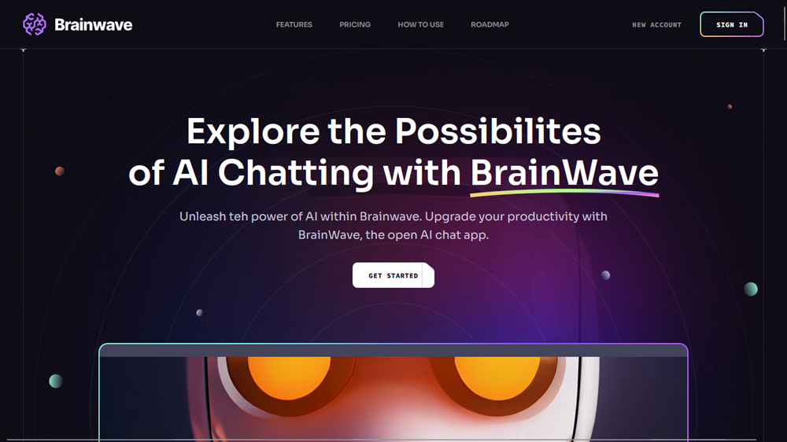
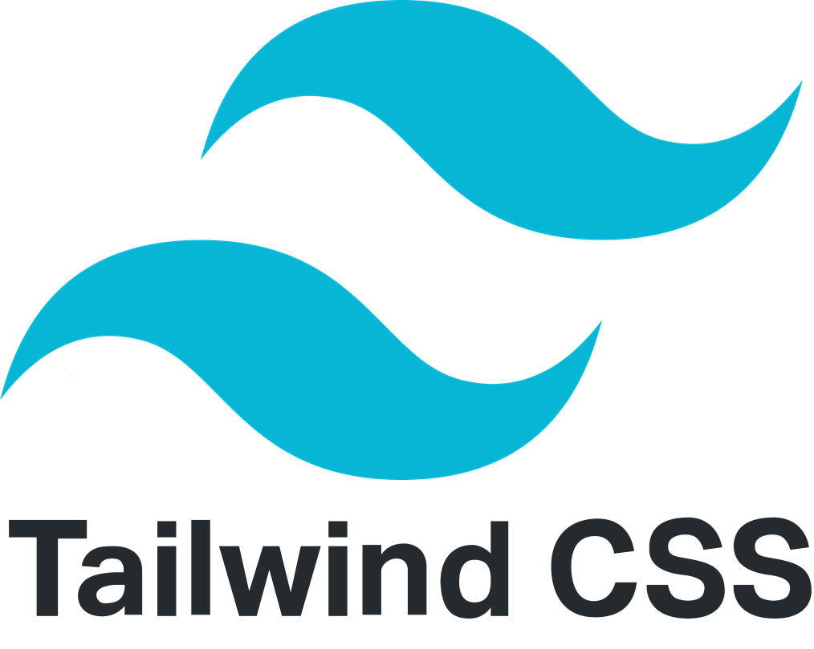

    

# Brainwave
A React and Tailwind CSS App ( You can view the website [here](https://brainwave-react-app.netlify.app/) )

---

This is a [React](https://react.dev/) application that uses [Tailwind](https://tailwindcss.com/) Css for rendering a responsive modern UI/UX website.
    
- **Focus on user experience**:
    - This React application leverages Tailwind CSS to craft a stunning and responsive user experience, ensuring your website adapts seamlessly to any device while maintaining a modern aesthetic

- **Highlight visual appeal**:
    - Built with React and Tailwind CSS, this website delivers a captivating and responsive design. Expect beautiful visuals that adjust perfectly to different screen sizes, offering a modern user experience.

    
    &emsp;
    

## Getting Started

These instructions will get you set up to develop and run the project locally.

### Prerequisites

[Node.js](https://nodejs.org/) and npm (or yarn) installed on your machine. Download and install them from the official website if you don't have them already.

### Installation

Clone the repository:

    git clone https://github.com/mamebb2023/react-app.git

Navigate to the project directory:

    cd react-app

Install dependencies:

    npm install  # or yarn install

### Development

Start the development server:

    npm run start  # or yarn start

By default go to

    http://localhost:5173/

to view the website
